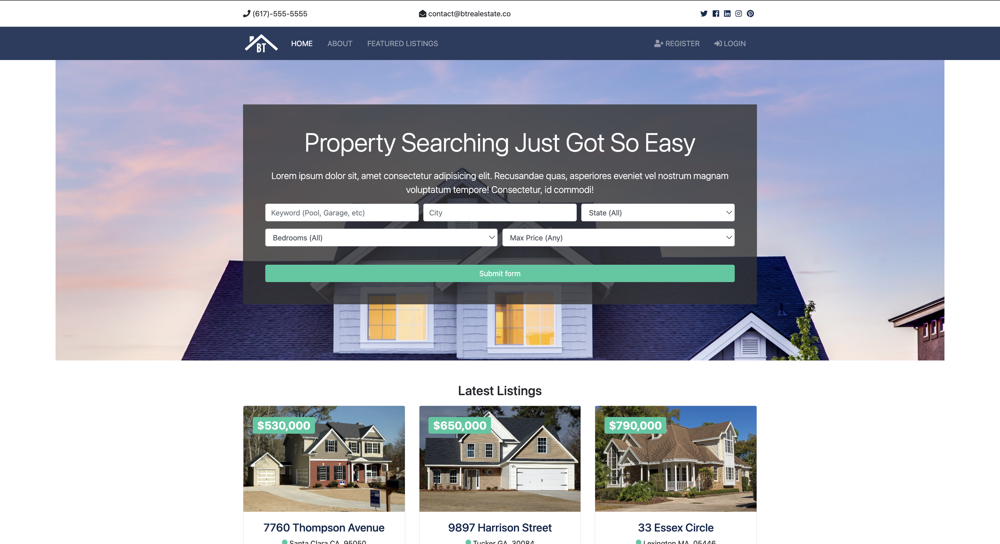

# Django App - BT REAL ESTATE



# Setup

I would suggest to make use of virtual environments to run any kind of application. (I personally use [pipenv](https://pipenv-fork.readthedocs.io/en/latest/basics.html))

`requirements.txt` can be found at top level directory of the project folder.


## Install pipenv

Windows Users

`pip install pipenv`


Mac/Linux Users

`pip3 install pipenv`


Use `pipenv shell` to create a virtual environment. Once, the environment is created.

If you only have a `requirements.txt` file available when running `pipenv install`, pipenv will automatically import the contents of this file and create a `Pipfile` for you.

You can also specify `pipenv install -r path/to/requirements.txt` to import a requirements file.


## Setting up Database

Creating a PostgreSQL database involves several steps, including installing PostgreSQL, accessing the PostgreSQL command line, and executing SQL commands. Here's a general guide:

### 1. Install PostgreSQL:

- **Linux:**
  ```bash
  sudo apt-get update
  sudo apt-get install postgresql postgresql-contrib
  ```

- **macOS:**
  ```bash
  brew install postgresql
  ```

- **Windows:**
  Download and install PostgreSQL from the official website: [PostgreSQL Downloads](https://www.postgresql.org/download/)

### 2. Access PostgreSQL:

- **Linux & macOS:**
  Open a terminal and access the PostgreSQL command line using the `psql` command.
  ```bash
  psql -U postgres
  ```

- **Windows:**
  Open the SQL Shell (psql) from the PostgreSQL installation in your Start menu.

### 3. Create a Database:

```sql
CREATE DATABASE yourdatabasename;
```

Replace `yourdatabasename` with the desired name for your database.

### 4. Connect to the Database:

```sql
\c yourdatabasename
```

This command connects to the database you just created.

### 5. Create a User (Optional, but recommended for security):

```sql
CREATE USER yourusername WITH PASSWORD 'yourpassword';
```

Replace `yourusername` and `yourpassword` with the desired username and password for your database user.

### 6. Grant Privileges to the User:

```sql
GRANT ALL PRIVILEGES ON DATABASE yourdatabasename TO yourusername;
```

### 7. Exit the PostgreSQL Command Line:

```sql
\q
```

This command exits the PostgreSQL command line.

### 8. Connect to the Database with the New User:

```bash
psql -U yourusername -d yourdatabasename -h localhost
```

Replace `yourusername` and `yourdatabasename` with your actual username and database name.

Now, you have successfully created a PostgreSQL database, user, and connected to the database.

## Connecting to Database

Make sure you have installed `python-dotenv` package before following the below steps: 

### 1. Create a .env file in the root directory

Fill in the details that you created in the above steps [3](#3-create-a-database) and [5](#5-create-a-user-optional-but-recommended-for-security)

```
DB_NAME = "YOUR_DATABASE_NAME"
DB_USER = "YOUR_DATABASE_USER_NAME"
DB_PASSWORD = "YOUR_DATABASE_PASSWORD"
```

### 2. Settings file

In btre/settings.py, add the following code:
```
from dotenv import dotenv_values
config = dotenv_values(".env")
```

And below in the database section add the following:
```
DATABASES = {
    "default": {
        "ENGINE": "django.db.backends.postgresql",
        "NAME": config["DB_NAME"],
        "USER": config["DB_USER"],
        "PASSWORD": config["DB_PASSWORD"],
        "HOST": "127.0.0.1",
        "PORT": "5432",
    }
}
```


# Running the Django Application
To run the application, activate the virtual environment and then write  
`python manage.py runserver`


> Congratulations! 🎉 Your Django application is ready and running @ http://127.0.0.1:8000/